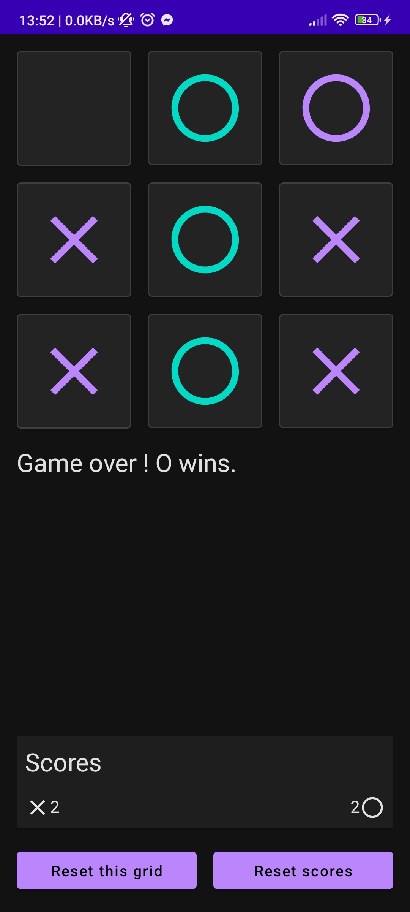
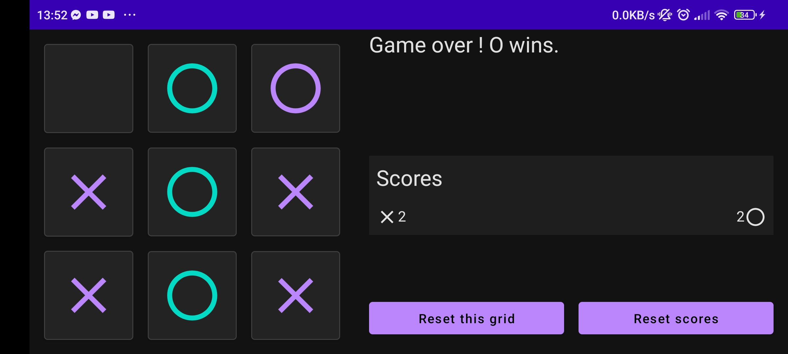

# Tic Tac Toe

A simple Android application written in Kotlin with the Jetpack Compose framework. It is composed of a single screen whose layout changes depending on screen orientation.

## Try it !

[Unsigned debug APK](https://drive.google.com/drive/folders/1vcA66r1om0zcJ1nkFuAj_Iq2p7Fuavcz?usp=share_link)

## Screenshots

